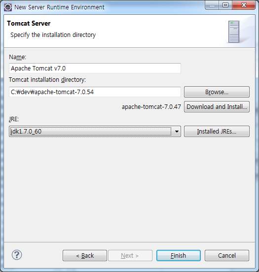

# VICER_SPRINGSERVER

## 소개
클라이언트가 어플을 통하여 로그인, 회원가입, 시리얼 번호를 http통신으로 확인하기 위한 Web Server

#### Web Server 기능
* 자바 플랫폼을 위한 오픈소스 애플리케이션 프레임 워크인 Spring을 사용하여 안드로이드와 연동을 통해
데이터베이스로 접근 시 보안적인 이슈를 해결 할 수 있으며 쉽게 App과 Web간의 통신이 가능하다.

## 개발환경 설정 실행환경
eclipse를 사용하여 Spring Web Server를 구현하였다.
### JDK
* 먼저 아래의 링크에 가서 jdk를 설치해야한다. 
https://www.oracle.com/technetwork/java/javase/downloads/index.html
다운 받은 후 제어판 -> 고급 시스템 설정 -> 고급 -> 환경 변수를 클릭하고 아래와같이 jdk의 저장폴더 위치를 넣어준다.

추가적으로 CLASS_PATH,PATH도 똑같이 환경 설정을 해준다.

### Tomcat
* Java Servlet & JSP 기술 구현을 위한 Open Source이다. 
먼저 아래의 링크에 가서 그림과같이 tomcat을 다운 받는다.
http://tomcat.apache.org/

### Maven
* Maven은 Java개발에 필요한 각종 라이브리 의존성, 빌드, 테스트를 자동화해주는 툴이다.
대부분 Java개발이 대규모로 이루어지고 있어 이러한 것을 자동으로 처리해주는 필요가 많이 생겼는데 그것을 자동으로 해준다.
* 설치는 아주 간단하다 아래의 Maven 홈페이지에서 다운받아서 압축해제만 해주면 끝이다.
https://maven.apache.org/
* 설치를 했다면 설정을 해주기 위해 Maven 설치한 디렉토리에 아래와 같이 repository라는 디렉토리를 생성한다.
 
conf 디렉토리에 보면 setting.xml 파일을 텍스트 에디터로 열어서 아래와 같이 localRepository 부분에
방금 생성한 repository 디렉토리를 지정해준다.

### Eclipse
* Eclipse 설치를 위해서 홈페이지에 가보면 다양한 Eclipse를 볼 수 있다.
그것들은 마치 STS와 동일한 것들이라고 보면 된다. C/C++ 를 위한 Eclipse, PHP를 위한 Eclipse, java를 위한
Eclipse 등 많은 Eclipse 통합 제품들을 제공하는데 우리는 Java EE를 위한 Eclipse를 아래의 링크에서 다운받는다.
   * www.eclipse.org
   
   
* Spring 환경설정
   * Spring Tools Suite Plugin 설치 
   Plugin 설치는 Marketplace를 이용해서 아주 쉽게 할 수 있다. 
   'Help'메뉴 -> Eclipse Marketplace를 클릭하면 MarketPlace가 실행된다. 
    
   위 화면과 같이 'Spring'으로 검색해서 나오는 'Spring IDE 3.7.3.RELEASE'에 install 클릭해준다. 
    
   * Maven 설정 
   Eclipse를 실행하고 'Window'메뉴 -> Preferences를 클릭하고 나오는 창에서 'maven'으로 검색한다.
    
   위 화면과 같이 'User Settings' 부분에 앞에서 Maven 설치지에 수정했었던 settings.xml 파일을 인식 시켜준다.
    
   마지막으로 위 화면과 같이 Maven은 jdk의 tools.jar을 library에 포함시켜줘야 한다. 
    
   * Tomcat 설정 
   상단의 Window -> Preference -> Server -> Runtime Environment -> Add 클릭
   
    
   위 그림과 같이 tomcat을 추가해주고 jdk를 추가해준다. 그 후 OK를 누르면 tomcat설정 완료된다. 
## 사용 법
* 깃에 첨부된 Spring project를 다운받아서 Eclipse로 열어준다.
* Server를 실행시켜준다.
* Client접근을 위해 port를 아래와 같이 열어준다.
   * 제어판 -> 시스템 및 보안 -> Windows 방화벽 -> 고급 설정(왼쪽 메뉴)를 클릭하면 아래의 화면이 나온다. 
    
   1. 왼쪽의 인바운드 규칙을 누르면 나타나는 오른쪽 메뉴에서 '새 규칙'을 클릭한다. 
   2. 규칙 종류에선 포트를 선택한다. 
   3. 프로토콜 및 포트에선 TCP, 특정 포털 포트(열 포트번호 입력한다.) 
   4. 작업에선 연결허용을 선택한다. 
   5. 프로필은 모두선택한다. 
   6. 이름은 사용자가 지정한다.  
   그후 마침을 누르면 아래와 같이 방금 입력한 이름으로 규칙이 완성되어 목록에 나타납니다. 
    
## 라이센스
* jdk: https://www.oracle.com/technetwork/java/javase/terms/license/index.html
* tomcat: http://tomcat.apache.org/legal.html
* Eclipse: https://www.eclipse.org/org/documents/epl-v10.php
* Maven: https://www.mojohaus.org/license-maven-plugin/
* Spring(Apache): http://www.apache.org/licenses/LICENSE-2.0
